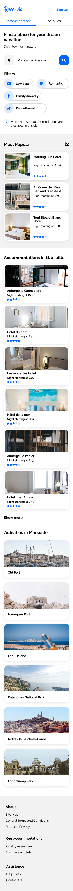

# Reservia
Turn Mock-ups into a web page:

## Features
- Users will be able to search for accommodations in the city of their choice. Therefore, the search field is an input field, the text of which can be edited by the user. However, at this stage the search button will not be functional.
- Each accommodation or activity card will have to be clickable in its entirety. For the moment, the links will be empty.
- The filters will not be functional for this version; however, they must change their appearance when hovered over, I leave it up to you to decide the most appropriate effect.
- In the menu, the Accommodations and Activities links are anchors that should lead to sections of the page.

## Technical constraints
- I'm providing you with two mock-ups; one desktop and one mobile. The site will also have to be adapted for tables. You are free to make the necessary adaptations with the layout, as long as no elements are cut, and the text is a suficient size. I'll let you choose the appropriate breakpoints.
- As I didn't know which image sizes and formats you need, I exported a variety. I'll let you choose the most suitable format concerning resolution and loading time.
- The icons come from the [Font Awesome Library](https://fontawesome.com/). The colors of the chart are blue #0065FC and its lighter version #DEEBFF, as well as grey for the background #F2F2
- The site font is ["Raleway"](https://fonts.google.com/specimen/Raleway).

## Instructions
- Don't use a framework or a pre-compiler for this project.
- Recommend using Visual Studio Code.
- You can integrate Font Awesome icon in HTML and CSS. 
- The site should be compatible with the latest versions of Chrome and Firefox.
- Separate HTML and CSS and to organize your folders accordingly.
- Don't forget to version your code with Git from the beginning.

## Deliverables 
- A link to GitHub or GitLab repository and include:
  - The code versioned on GitHub or Git Lab.
  - A link to your web page hosted online on GitHub Pages or GitLab Pages in the README.

## Mock-up desktop

## Mock-up phone

